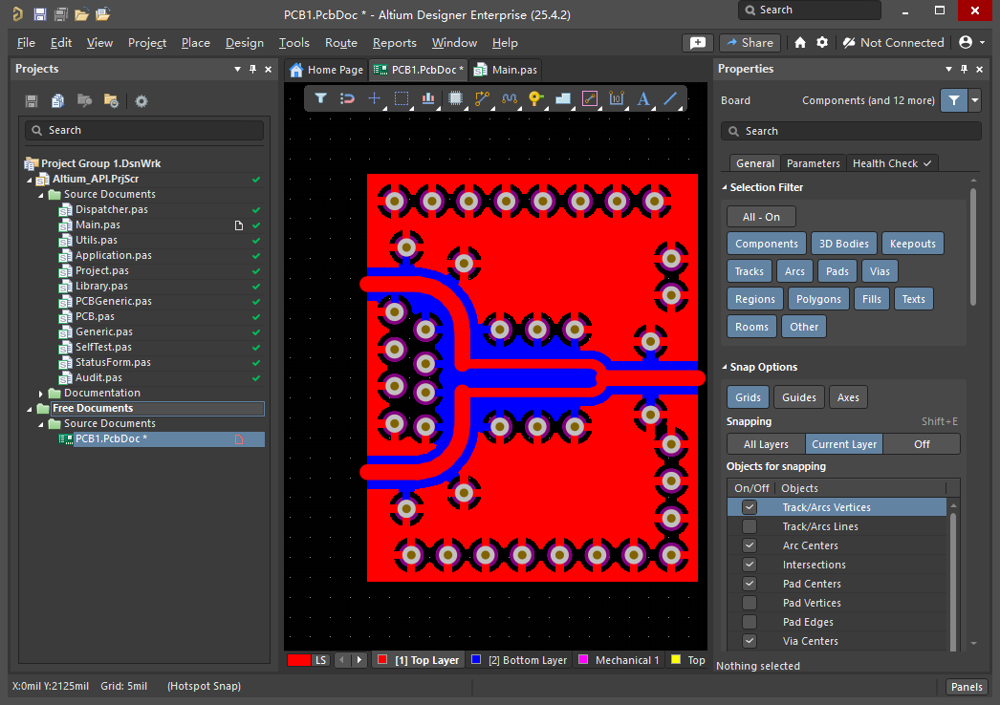
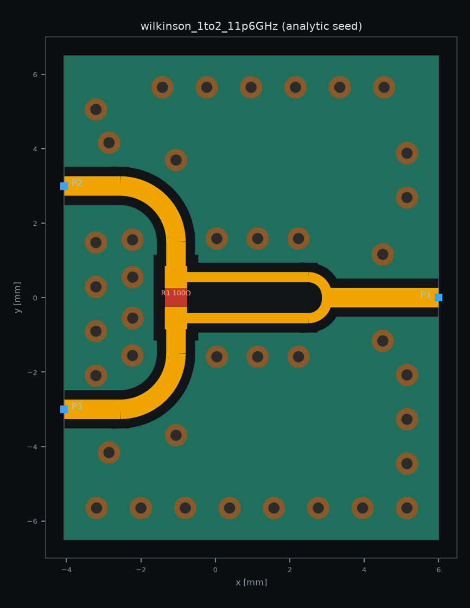
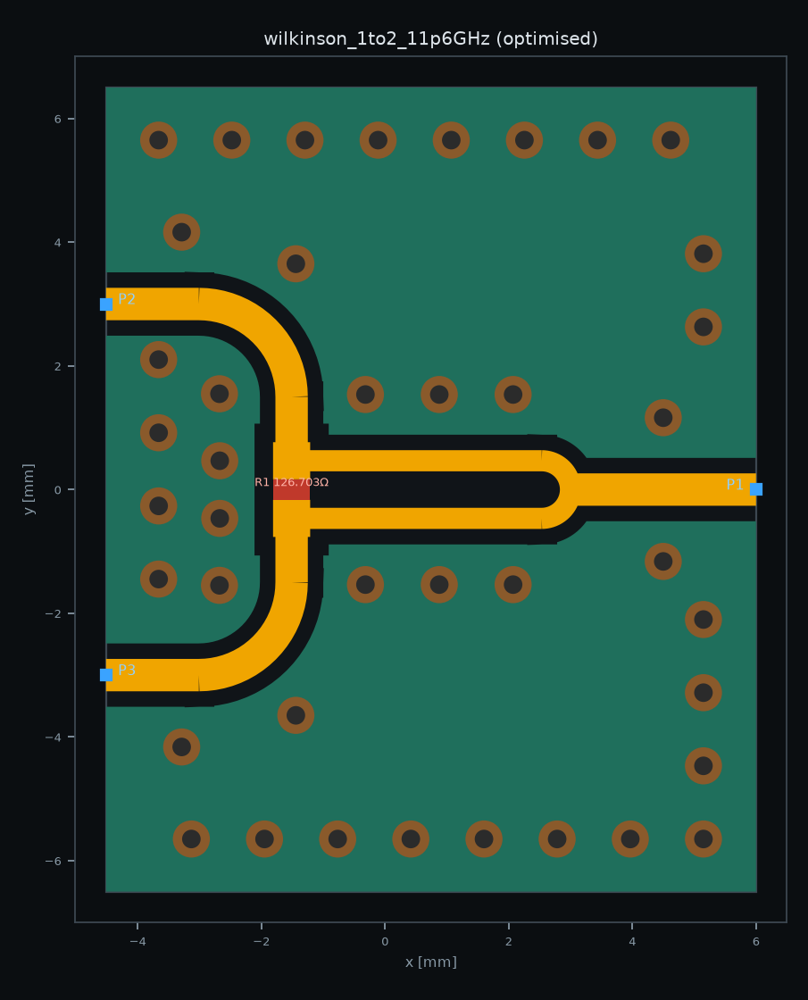
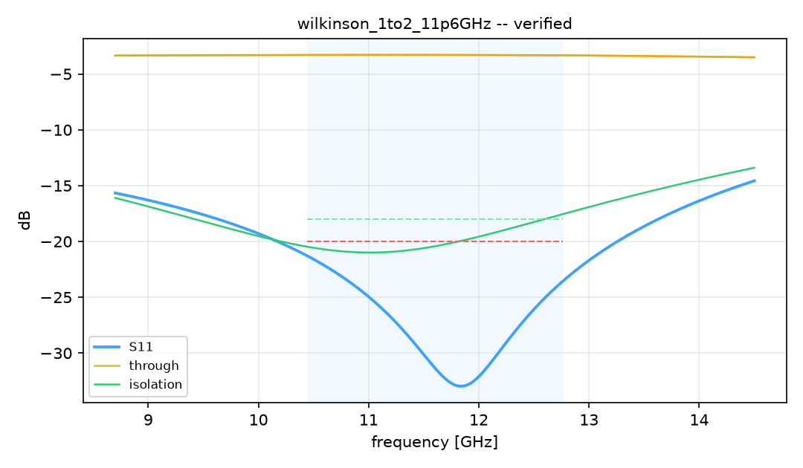

# 11.6 GHz 1:2 Wilkinson divider

A worked, recorded run of the whole loop: one sentence of requirement in,
an EM-verified board out. Everything under [`results/`](results/) is the
real output of the run described here — 30 HFSS solves, 23.8 minutes of
solver time — not a mock-up.

> 1:2 Wilkinson LO divider for X-band local-oscillator distribution,
> GCPW on 0.254 mm RO4350B, in a metal cavity

| | |
|---|---|
| centre frequency | 11.6 GHz |
| band | 10.44 – 12.76 GHz (20 %) |
| laminate | RO4350B 0.254 mm, εr 3.66, tanδ 0.0037 |
| requirements | S11 ≤ −20 dB, isolation ≤ −18 dB, excess loss ≤ 0.5 dB, amplitude balance ≤ 0.3 dB |

The full requirement is [`spec.json`](spec.json). It is the only input.

## Running it

Three stages, increasingly demanding of your machine.

**Stage 1 — synthesis. No solver, runs anywhere.**

```bash
uv run python examples/wilkinson_11g6/01_synthesize.py
```

Sizes the lines from the conformal-mapping GCPW model, generates the
layout, runs the fab-rule check, writes a DXF and a preview PNG. About a
second. This is the honest place to start.

**Stage 2 — the closed loop. Needs HFSS.**

```bash
uv run python examples/wilkinson_11g6/02_optimize.py --trials 30
```

Optuna proposes dimensions → fab rules reject the unbuildable ones for
free → HFSS solves the rest → scikit-rf reduces S-parameters to the six
spec numbers → one scalar loss. The winner is re-solved at full mesh
fidelity, then again with its widths snapped to Altium's 1 mil (25.4 µm)
placement grid. The study is resumable; re-running with a larger
`--trials` continues it.

**Stage 3 — into Altium. Needs Altium + the eda-agent bridge.**

```bash
uv run python examples/wilkinson_11g6/03_to_altium.py          # dry run
uv run python examples/wilkinson_11g6/03_to_altium.py --write  # commit
```

Dry run plans every primitive and places nothing. It works with Altium
closed, and is worth reading first:

```
n_tracks 87   n_vias 41   nets ['RF_IN', 'GND']
polygon  TopLayer    GND  1822,1744 -> 2236,2256   (coplanar ground)
polygon  BottomLayer GND  1822,1744 -> 2236,2256   (ground plane)
rules    RF_Clearance_10mil (clearance, 10 mil, different_nets)
```

To commit you need Altium running with the target PcbDoc open, eda-agent
installed, and its bridge polling — in Altium: **File → Run Script →
`Altium_API` → `Dispatcher.pas` → `StartMCPServer`**.

This has been run for real, and running it for real is what found two
bugs that no amount of dry-running would have.

**The board came out electrically inert.** The bridge splits its net
list on `|`; rf-agent joined it with a comma. Nothing errored — Altium
cheerfully created a single net named `RF_IN,GND`, after which every
track, via and pour asking for `RF_IN` or `GND` missed its lookup and
landed with no net at all. The copper was pixel-perfect and connected
to nothing.

**There was no ground plane.** The whole EM model rests on a solid
conductor at z=0 — that is what HFSS's PEC outer boundary *is*, and it
is what all 41 stitching vias are drilled down to reach. The writer only
ever placed the top-side coplanar pour, so the vias landed on bare
laminate, and the top pour stayed in the three electrically separate
islands its own traces cut it into. Altium reported five unrouted GND
connections and was right to.

Both are fixed and pinned by tests. After the fix, read back from the
live board:

| | planned | in Altium | |
|---|---|---|---|
| tracks | 87 | 87 | match |
| vias | 41 | 41 | match |
| pours | 2 | 2 | match |
| tracks on `RF_IN` | 87 | 87 | match |
| vias on `GND` | 41 | 41 | match |
| **unrouted connections** | 0 | **0** | match |
| routed length | 22.331 mm | 22.410 mm | +0.35 % |

Every one of the 87 track segments also matches the plan
coordinate-for-coordinate and width-for-width, and all 41 via positions
match exactly — zero differences in either direction. The 0.079 mm of
extra copper is the endpoints rounding onto the 25.4 µm grid, the same
quantisation the design was re-solved against turning up independently.



Red is the top-layer coplanar ground, blue the bottom-layer plane
showing through the gaps. Everything came from the spec: 50 Ω feed on
the right, two 63 Ω arms, two outputs on the left, the via fence
tracking each trace at its own width-dependent offset, the board-edge
ring, and a 10 mil clearance rule. No part of it was drawn by hand.
[`altium_write.json`](results/altium_write.json) is the full record.

What is still missing, because the screenshot will not tell you: the
board has **0 pads and 0 components**. The isolation resistor is a
lumped boundary in HFSS and the writer emits only routed tracks, so
R1's two solder lands never arrive and the pour keepout leaves a bare
gap where the chip belongs. This is a routed, stitched, net-clean RF
structure — not yet a fabricable PcbDoc.

## What happened

### The analytic seed is not good enough

Trial 0 is the textbook answer: arms one quarter-wave long at the
geometric-mean impedance, 100 Ω isolation resistor.

| | seed | required |
|---|---|---|
| worst in-band S11 | **−17.07 dB** | ≤ −20 |
| isolation | −20.04 dB | ≤ −18 |
| match centred at | 12.69 GHz | 11.6 |

It misses by 3 dB, and the match sits 1.1 GHz high. The tee and the two
bends add electrical length the straight-line model cannot see. That gap
is the entire reason the EM loop exists.



### 30 trials later

| parameter | seed | optimised | Δ |
|---|---|---|---|
| `l_arm` | 4.6067 mm | **4.9752 mm** | +8.0 % |
| `w_arm` | 0.2753 mm | **0.3419 mm** | +24 % |
| `r_sep` | 1.1000 mm | 0.9319 mm | −15 % |
| `r_ohms` | 100.0 Ω | 126.7 Ω | +27 % |

The loop rediscovered, on its own, that the drawn arm has to run longer
than λ/4 — and pushed it 8 % over, the same direction and roughly the
same size as the hand-tuned original this model was correlated against.

It also widened the arm well away from the textbook 70.7 Ω (0.3419 mm is
63.4 Ω) and traded that against a larger isolation resistor. That is a
real Wilkinson trade, not a numerical artefact: arm impedance sets the
match, the resistor sets isolation, and the two fight over the same
bandwidth.




### The result

| requirement | limit | analytic seed | optimised | as built |
|---|---|---|---|---|
| S11 | ≤ −20.0 dB | −17.07 **fails** | **−21.28** | **−22.72** |
| isolation | ≤ −18.0 dB | −20.04 | −17.56 *(−0.44)* | **−18.43** |
| output return loss | ≤ −16.0 dB | −21.69 | −19.50 | −18.92 |
| excess loss | ≤ 0.5 dB | 0.36 | 0.32 | 0.33 |
| amplitude imbalance | ≤ 0.3 dB | 0.02 | 0.01 | 0.03 |
| phase imbalance | ≤ 3.0° | 0.12 | 0.06 | 0.05 |

*"as built" = the same design re-solved with every trace width snapped to
Altium's 1 mil (25.4 µm) placement grid, which is the board you actually
get.*

**The board meets every requirement.** From one sentence of English, with
no human in the loop, in 24 minutes of solver time: return loss improved
by 4.2 dB, the match recentred from 12.69 GHz onto 11.83 GHz, and the
balance metrics land 30× and 50× inside their limits. That is a working
X-band divider, and nothing about it was drawn by hand.

Two things it is worth being precise about, because the report is and
you should expect that of it:

**Isolation clears by 0.44 dB, and it clears on a technicality.** In
continuous dimensions the winner *misses* isolation, at the very top of
the band. Snapping the widths to the 25.4 µm grid moved it back inside.
The margin is real but it is thin, and it was not designed — it was
inherited from rounding. The generated report
[says exactly that](results/report.md) rather than quietly banking the
win, which is the behaviour you want from a tool that will otherwise
hand you a board and a PASS.

**Isolation is also the metric this model is least entitled to boast
about.** The resistors are ideal lumped elements; a real 0402 thin-film
part carries parasitic inductance that costs isolation above roughly
10 GHz. The 18.43 dB is an upper bound, not a promise.

The engineering conclusion: a single-section Wilkinson is near its limit
over a 20 % band. If −18 dB isolation is genuinely hard, the answer is a
two-section divider — more trials will not buy it.

## What is in `results/`

| file | |
|---|---|
| [`report.md`](results/report.md) | the generated design report |
| [`trials.csv`](results/trials.csv) | all 30 trials — parameters, six metrics, solve time |
| [`divider_optimised.s3p`](results/divider_optimised.s3p) | HFSS S-parameters of the winner, 201 points |
| [`divider.dxf`](results/divider.dxf) | full-precision layout, copper + vias + board outline |
| `layout_seed.png`, `layout_optimised.png`, `sparams.png` | figures from the run |
| [`altium_written.png`](results/altium_written.png) | the design written into a live Altium session |
| [`altium_write.json`](results/altium_write.json) | what was planned vs what Altium reports back |

Two edits were made to these artefacts before publication, both cosmetic:
the requirement sentence was reworded to drop the name of the programme
it was written for, and HFSS's absolute output path was removed from the
touchstone header. No number, dimension or measured value was touched.

`trials.csv` is the interesting one if you want to see the search behave.
Rank correlation of each parameter against the loss, over the 30 trials:

| parameter | Pearson | Spearman |
|---|---|---|
| `r_sep` | +0.42 | +0.38 |
| `l_arm` | −0.37 | −0.39 |
| `w_arm` | −0.13 | −0.19 |
| `r_ohms` | +0.01 | +0.05 |

Not what you would guess. The arm separation at the resistor moves the
loss slightly more than the arm length does — it sets the size of the
junction discontinuity, and at 11.6 GHz on 0.254 mm laminate that
discontinuity is a large fraction of the whole design problem.

`r_ohms` shows almost no *marginal* correlation, which is not the same as
not mattering: it trades against arm impedance rather than acting alone,
and the winning trial moved it 27 %. Reading a one-parameter-at-a-time
correlation as an importance ranking would be a mistake here.

## Caveats that apply to these numbers

Carried from the report, because they decide whether the result transfers
to your board:

- The EM model has **no radiation boundary**. Outer faces are PEC, which
  represents a metal housing. A board in free space or under a plastic
  lid will behave differently.
- Exploration ran at a draft mesh (ΔS 0.05, 6 passes); the reported
  figures come from a full-fidelity re-solve (ΔS 0.02, 12 passes).
- Isolation resistors are ideal lumped elements.
- εr is the single design value 3.66. Dispersion and batch tolerance are
  not swept.
- Ground-via pitch is 1.20 mm where λg/12 at f0 is 1.126 mm. Stage 1
  flags this. It is inherited from the correlated design and is a known,
  deliberate, slightly-coarse choice — not an oversight.
